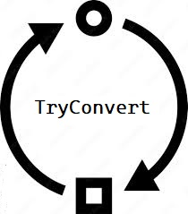

# TryConvert 

## The program is written for .NET5

# TryConvert for any Type

The TryConvert class provides a collection of methods for converting types.

## Example
```
Dictionary<int,string> dict = new Dictionary<int, string>() 
{
    { 1, "value1" },
    { 2, "value2" }
};

string text = TryConvert.ToString(dict);

```
# Result
```
1=value1;2=value2
```